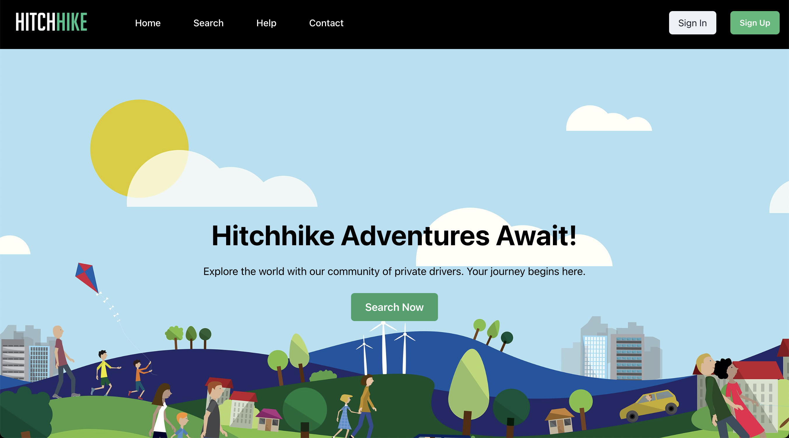
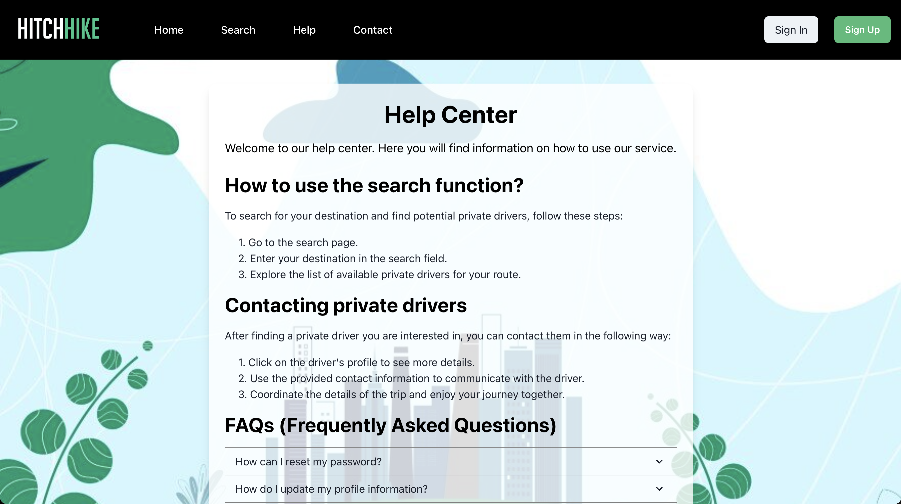
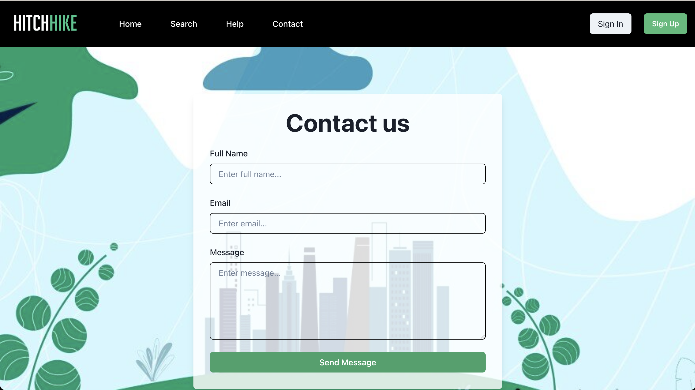
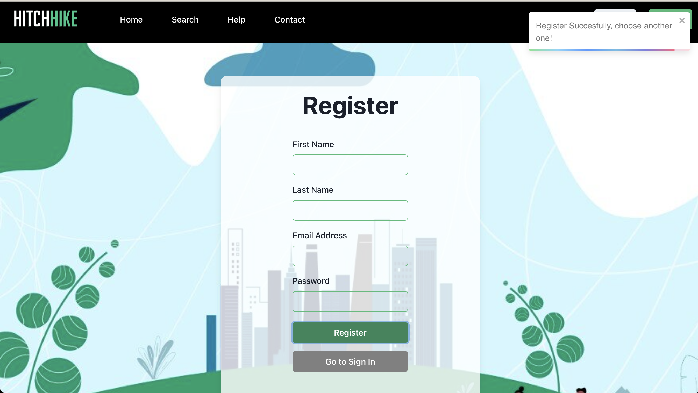

# Hitchhike Web

<p>
In this archive you will find the source code for Hitchhike.</p>
 
 
 
 
 
 

## Link for project documentation

*GOOGLE DOC:*

*FIGMA:*
https://www.figma.com/file/M8UkyJXDctD5wybLd45MQw/Untitled?type=design&node-id=0%3A1&mode=design&t=rzacFxYqZnWkfOMk-1

## Built with

[React](https://react.dev/)

[Node JS](https://nodejs.org/en/)

[Javascript](https://www.w3schools.com/js/)

[Express JS](https://expressjs.com/)


[Mongo Db](https://www.mongodb.com/)

[Chakra UI](https://chakra-ui.com/)

## Getting Started

**Create a MongoDB**

1. Visit https://mongodb.com and register an account

2. Create a project and a free shared database

3. After creation, click on Connect and choose Connect your application

4. Make sure Driver is set to Node.js

5. Save the URI string, and replace the password with a password of your choice, and replace myFirstDatabase with the name you want your database to have


Installation

1. Clone the repository to your local files.

2. Install npm packages for both the front- and backend. Frontend files are located in the /frontend folder. Backend files are located in the /backend folder.

```bash
npm install
```

3. To start the Node server, in the backend folder, run:

```bash
npm run start
```
4. To start the Vue server, in the frontend folder, run:
```bash
npm run dev
```

## License

Distributed under the MIT License.

## Contact

```python
Author: Coraliney Gryglas
Email: Carro_Gryglas@hotmail.com
Lindedin: https://www.linkedin.com/in/caroline-gryglas/
```
